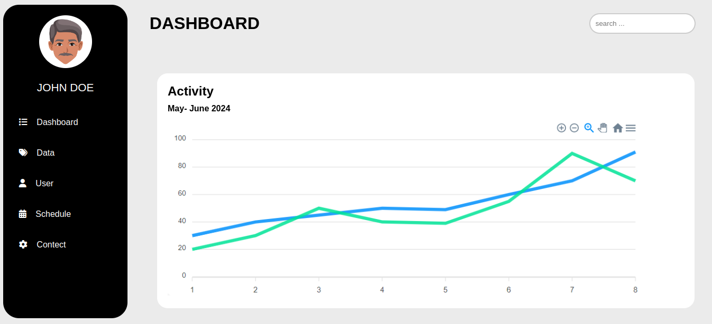
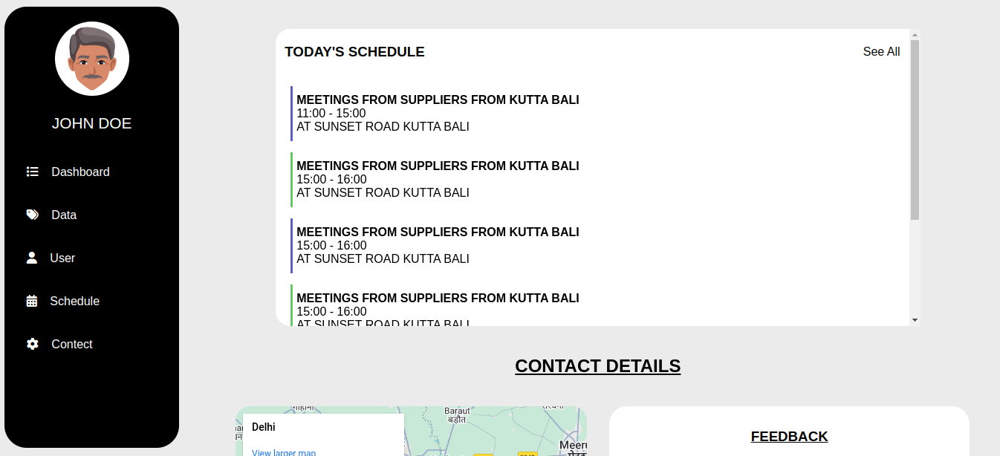

# Dashboard Project
This is a Dashboard web project built using HTML and CSS only. It provides  user-friendly interface to display various widgets, charts, or data points, making it ideal for use in admin panels or monitoring systems.

if you want visit website . please click here

[click here](https://rahulchoudhuri.github.io/Dashboard-Project/)

## Screenshots --






## Features
- **Modular Widgets:** Includes various predefined widgets to display different data points like stats, charts, and notifications.
- **User-Friendly Interface:** Simple and clean design focused on user interaction.

## Installation
1. Clone the repository (or download the zip file):

```bash
git clone https://github.com/your-username/dashboard-project.git
```
**Open the index.html** file in any browser to view the dashboard.

You don’t need any server or backend setup for this project. It's purely HTML/CSS based.

## Usage
1. Open the project folder and navigate to index.html.
2. Simply double-click on the index.html file or open it with your preferred web browser to see the dashboard in action.
3. You can customize the layout or colors by modifying the style.css file.

## Folder Structure
```bash
dashboard-project/
│
├── index.html      # Main HTML file for the Dashboard
└── style.css       # The CSS styles for the Dashboard
```
## Technologies Used

- HTML5: For structure and layout.
- CSS3: For styling and responsiveness.

## Customization
- Modify the style.css file to change colors, font styles, or layout.
- Add new HTML elements or components as needed, depending on your requirements.
- You can integrate JavaScript to add dynamic functionalities like real-time data updates or user interactions.

## Contributing
 If you want to contribute to the project, feel free to fork it and create a pull request. Suggestions and improvements are always welcome.

## License
This project is open-source and available under the MIT License. See the LICENSE file for more details.

## Acknowledgements
- FontAwesome for icons (if you're using any icons).
- Google Fonts for custom fonts (if applicable).
